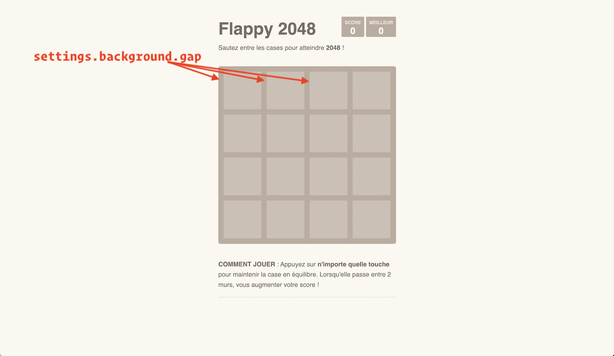
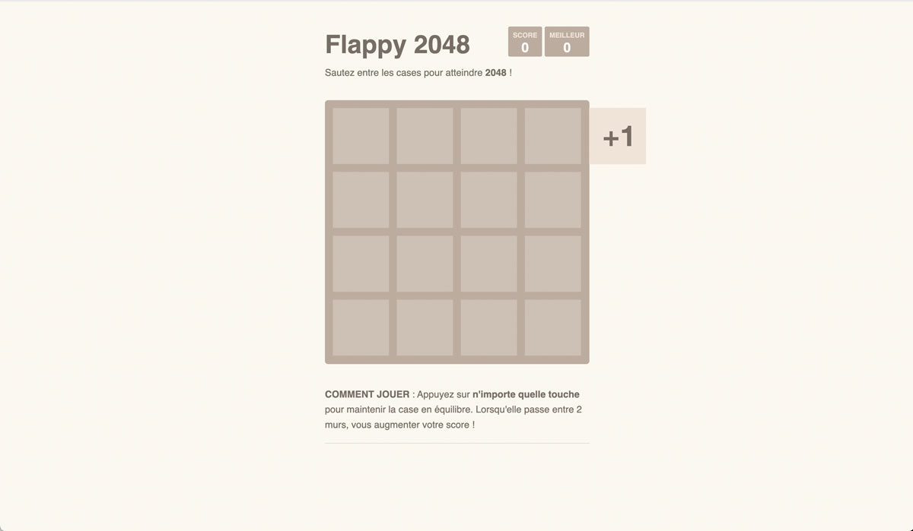
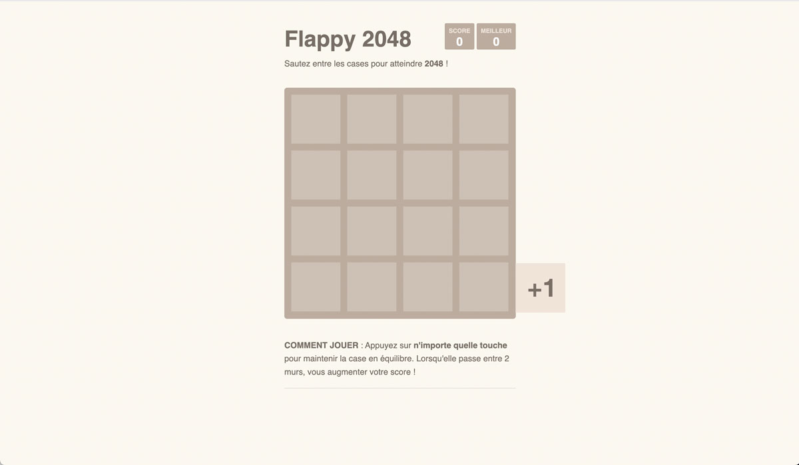
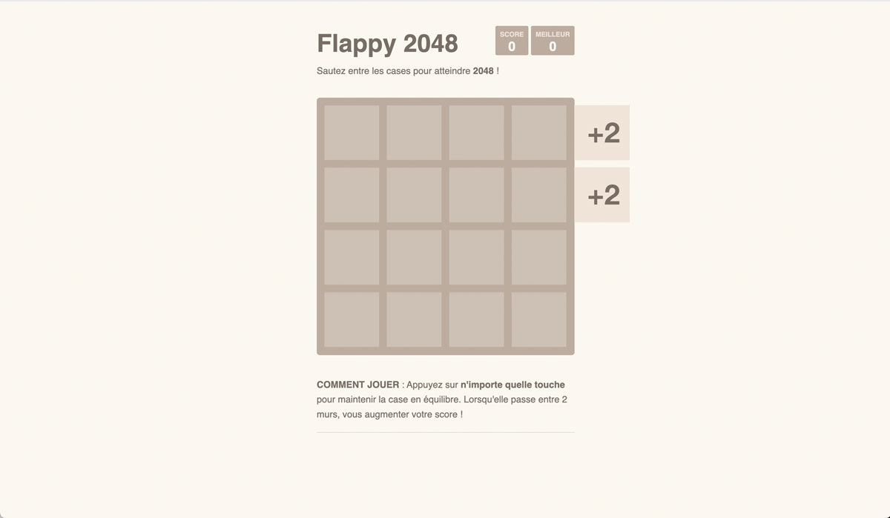
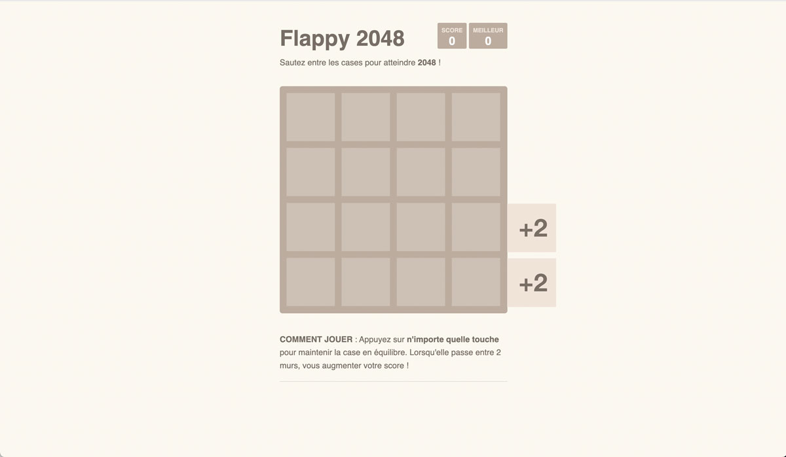
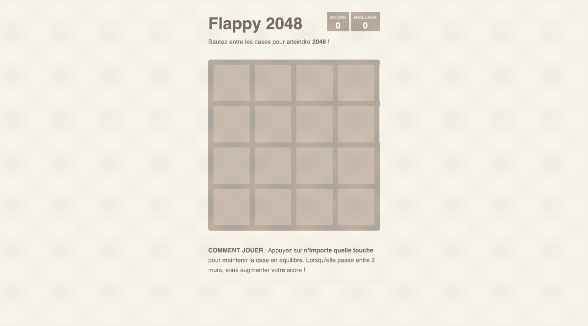
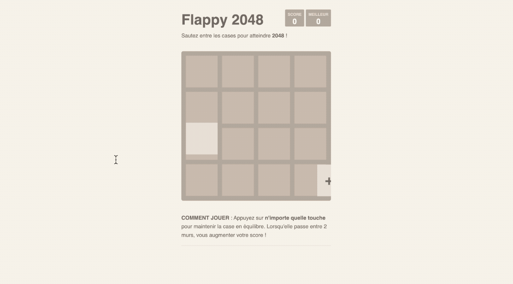

# 2048

> Examen DCC — aout 2022

## Préambule

1. Dans le cadre de cet examen de *Multimédia* vous devez uniquement vous focaliser sur les fichiers `*.ts`, qui se trouvent dans le dossier `src/ts/main.ts`. Mis à part, ajouter ou modifier une balise `script`, on ne vous demande pas de modifier le code HTML ni le code CSS qui s'y rapporte.
1. Cet examen dure *maximum 6 heures* et vous devez réaliser toutes les 30 minutes un *commit* ainsi qu'un *push* afin de publier votre état d'avancement (et soumettre une copie sur le serveur en cas de problème).
1. Vous devez respecter les bonnes pratiques vues en classe tant au niveau [de JavaScript](https://github.com/hepl-dcc/dcc-guidelines) que de [TypyScript](https://github.com/hepl-mmi/mmi-guidelines).
1. Tous les sélecteurs CSS dont vous avez besoin (pour cibler les éléments du DOM) ainsi que les paramètres du jeu sont définis dans l'objet `settings` dont le fichier porte le même nom.

## Énoncé

Dans le cadre de cet examen, nous vous demandons de programmer une version simplifiée du jeu *Flappy 2048* réalisé par Gabriele Cirulli. Il s'agit d'une version simplifiée de Flappy Bird avec des cases du jeu [2048](https://fr.wikipedia.org/wiki/2048_(jeu_vidéo)). Les règles du jeu sont les suivantes :

* Faire passer un carré entre les murs (sans les toucher). Ces murs sont composés d’autres carrés et permettent, en fonction de leur taille, de gagner des points quand ils sortent du canvas par la gauche.
* Cependant, quand on touche un carré du mur, on ne reçoit plus les points alloués à ce mur.
* Enfin quand on touche la bordure supérieure ou inférieure alors le score est remis à zéro.

Si vous parcourez le code HTML, vous allez vous apercevoir qu'on a superposé, par CSS, 3 éléments `<canvas>` :

1. `canvas#background`  : permet de dessiner une seule fois, au chargement de la page, le fond. À savoir une matrice carrée composée de 16 carrés de même tailles. Cette matrice n'est pas animée;
1. `canvas#wall` : permet de dessiner les murs composés de 2 ou 4 carrés. Ils se déplacent de la droite vers la gauche à une vitesse constante.
1. `canvas#birdie` : permet de dessiner le carré que l'utilisateur devra faire passer entre les murs afin de récolter les points alloués aux murs.

### Initialiser l'arrière-plan

Le fond est composé d'une matrice carrée composée de 16 carrés.

* Terminez de coder la classe `Square` afin de pouvoir dessiner un carré paramétrable.
* Servez-vous de la classe `Square` pour dessiner le fond dans la classe `Background` :
  * Dans le constructeur de la classe, calculez la longueur d’un côté du carré. Sachant que vous avez 4 carrés et donc 5 marges dont la taille et imposée par `settings.background.gap`. La taille du canvas doit être récupérée dynamiquement et ne sera jamais mise à jour;
  * Dans le constructeur de la classe, peuplez le tableau `squares` de carrés avec les bonnes informations. La couleur des carrés est donnée par la propriété `settings.background.color`;
  * Ensuite, dans la fonction `draw`, parcourez tous vos carrés pour appeler respectivement la méthode `draw` de chaque carré.

Le résultat attendu est le suivant :

### La boucle d'animation

Pour la boucle d'animation, il vous suffit :

* D'initialiser une instance de l'objet `Animation` ;
* Enregistrer les objets à animer grâce à la fonction `addIDrawable`. Ces objets doivent bien sûr implémenter l'interface `IDrawable`;
* Appelez une fois la fonction `animate` dès lors qu'on presse une touche pour la première fois.

### Les murs

Pour les murs, il s'agit de déterminer aléatoirement une des combinaisons possibles. Et d'animer ces murs jusqu'à ce qu'ils sortent entièrement du canvas pour les redisposer autrement. En fonction de la composition, un certain nombre de points peuvent être récoltés, à condition de ne toucher aucun des carrés qui composent le mur.

* Dans la fonction `initSquares` de la classe Wall, déterminez aléatoirement une des compositions de mur possibles. Le but étant d'insérer, dans le tableau, `squares` 1 ou 2 carrés. Dans tous les cas, les carrés doivent se situer, au début, en dehors du canvas sur le bord droit :
  * Combinaison 1 : la propriété `value` vaut 1;
  * Combinaison 2 : la propriété `value` vaut 1;
  * Combinaison 3 : la propriété `value` vaut 2;
  * Combinaison 4 : la propriété `value` vaut 2.
  
* Après la génération du mur, il ne vous reste plus qu'à l'animer depuis la fonction `animate`. Dans cette fonction vous devez :

  * Détecter s'il y a eu une collision grâce à la fonction `detectCollisions`;
  
  * Effacer les murs avec la fonction `clear` dans laquelle vous devez respectivement appeler la fonction `clear` des carrés contenus dans le mur en vous servant du tableau `squares`;

  * Mettre à jour les coordonnées de chaque carré sauf si le premier carré de votre mur sort entièrement du canvas. Dans ce cas, vous devez mettre à jour les coordonnées des carrés afin qu'ils entrent à nouveau par la droite.

### L'oiseau (qui n'en est pas un)

Bien entendu, il reste le dernier élément, qui est un simple carré qu'il s'agit de laisser tomber et de faire remonter dès lors que l'utilisateur relâche une touche du clavier. La classe `Birdie` est programmée pour faire tomber le carré, à condition de l'avoir enregistré dans les objets à animer. Il vous reste à :

* Appeler la fonction `goUp` au bon moment. C'est-à-dire quand l'utilisateur relâche une touche;
* Quand l'oiseau touche un des bords du canvas, vous devez appeler la fonction `clear` de l'objet `Score`;

### Gestions du score

Pour gérer le score, il faut :

* D'abord détecter les collisions entre le carré principal et les carrés composés par le mur. Pour ce faire, vous devez, dans la fonction d'animation du mur (donc pas de l’oiseau), détecter les collisions en complétant la fonction `detectCollisions`. Il suffit pour cela de parcourir les carrés contenus dans le tableau `squares` et de vérifier la collision avec l'oiseau en passant à la fonction `detectSquareCollision` les positions des 2 carrés. Si vous détectez une collision alors vous devez mettre la propriété `value` à zéro de sorte à ne pas comptabiliser de points quand les carrés sortent;
* Vous devez, au moment où vous détectez la sortie du mur, mettre à jour le score avec les points du mur. Pour cela, il suffit de multiplier la propreté `value` par le nombre d'éléments compris dans le tableau de carrés. Il vous suffit d'appeler la méthode `increment` de la propriété `score` contenue dans la classe.
* Compléter la classe `Score` pour aussi gérer le meilleur score . Si le meilleur score, à savoir le contenu textuel de la propriété `best`,  est inférieur au score actuel alors il faut mettre à jour le meilleur score en mettant à jour son contenu.

Le score augmente jusqu’à 7 puis je touche le bord supérieur, le score passe à 0 et le meilleur score passe à 7. Enfin, je gagne 4 nouveaux points.

